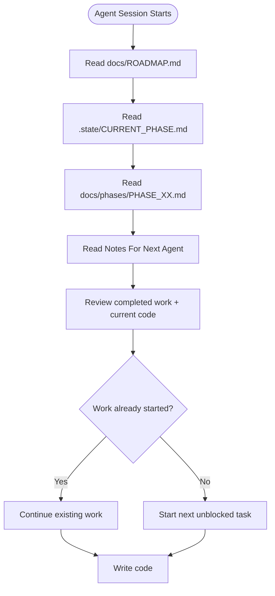

# Workflow: Agent Session

This workflow defines what every AI agent must do at the start, during, and at the end of each session. Follow these steps to maintain continuity, prevent lost work, and keep all state files synchronized.

---

## 1. Before Starting Work

Complete these steps **before writing any code**:

### Step 1 — Read the Roadmap

```
Read: docs/ROADMAP.md
```

Understand the current state of the project. Identify which phase is active, which are completed, and which are blocked.

### Step 2 — Identify the Active Phase

Find the phase marked as **In Progress** in `docs/ROADMAP.md`. If no phase is In Progress:

- If there are **Not Started** phases, the first Not Started phase becomes the active phase.
- If all phases are **Completed**, the project is finished — report this to the user.

### Step 3 — Read the Phase File

```
Read: docs/phases/PHASE_XX.md
```

Read the **entire** phase file — not just the checklist. Pay special attention to:

- **Completed Work** — know what previous agents already built.
- **Current Work** — know what was being worked on when the last session ended.
- **Remaining Work** — know what is left to do.
- **Blockers** — check if anything is preventing progress.
- **Decisions Made** — respect architectural decisions made by previous agents.
- **Notes For Next Agent** — **this is the most important section**. It contains exactly what you need to continue.

### Step 4 — Understand Unfinished Tasks

Review the task checklist in `PHASE_XX.md`. Identify:

- Tasks marked **Not Started** that are ready to begin.
- Tasks marked **In Progress** that may need continuation.
- Tasks marked **Blocked** and their blockers.

### Step 5 — Continue Existing Work

**Do NOT duplicate work.** If another agent has already completed part of a task, read their code first. If a task is marked **In Progress**, check the codebase to see how far it got before continuing.



---

## 2. During Development

Whenever the agent completes meaningful work, it **must**:

### Update Task Statuses

- Change task status from `Not Started` → `In Progress` when beginning work on a task.
- Change task status from `In Progress` → `Completed` when a task is fully finished and verified.

### Mark Completed Items

- Check off completed items in the task checklist.
- Update the completion percentage for the phase.

### Add Newly Discovered Tasks

If work reveals tasks that were not in the original checklist:

1. Add them to the task checklist with status `Not Started`.
2. Assign appropriate priority.
3. Add a note explaining why the task was discovered late.

### Record Implementation Decisions

If you make an architectural or implementation decision that a future agent needs to know about:

1. Add it to the **Decisions Made** section in `PHASE_XX.md`.
2. Add it to `.state/DECISIONS.md` for cross-phase visibility.
3. Include the **decision**, **rationale**, and **date**.
4. If the decision affects other phases, note that explicitly.

### Record Blockers

If you encounter anything preventing progress:

1. Add it to the **Blockers** section in `PHASE_XX.md`.
2. Add it to `.state/KNOWN_ISSUES.md` for cross-phase visibility.
3. Describe the blocker clearly.
4. Suggest a potential resolution if possible.
5. If the blocker affects the phase status, update `docs/ROADMAP.md` to mark the phase as `Blocked`.

### Record Modified Files

When you create or modify files, note them in the **Completed Work** log with the date and a brief description of what was done.

### Record Important Notes for Future Agents

Use the **Notes For Next Agent** section to leave context:

- ✅ What was done and why
- ✅ What remains and in what order
- ✅ Any warnings or pitfalls discovered
- ✅ Assumptions made
- ✅ Suggestions for the next agent
- ❌ Do NOT include overly verbose descriptions — be concise and actionable

---

## 3. After Completing Work

Before ending a session, every agent **must**:

### 1. Update PHASE_XX.md

Update **all** of the following sections in the active phase file:

| Section | What to Update |
|---------|---------------|
| **Task Checklist** | Mark completed tasks, update statuses |
| **Completed Work** | Add entries with date, description, and files modified |
| **Current Work** | Clear this section (you are no longer working) or describe the last thing you were doing if interrupted |
| **Remaining Work** | Update to reflect what is genuinely left |
| **Blockers** | Update blocker list (add/remove/resolve) |
| **Decisions Made** | Add any new decisions |
| **Notes For Next Agent** | **Rewrite this entire section** with current context |
| Completion Percentage | Recalculate based on tasks completed / total tasks |

### 2. Update ROADMAP.md (Only If Phase Status Changed)

Update `docs/ROADMAP.md` **only** when the overall status of a phase changes:

| Change | When to Update |
|--------|---------------|
| Phase: `Not Started` → `In Progress` | When the first task in the phase begins |
| Phase: `In Progress` → `Completed` | When ALL tasks in the phase are completed and verified |
| Phase: `In Progress` → `Blocked` | When a critical blocker prevents all progress |
| Phase: `Blocked` → `In Progress` | When the blocker is resolved |
| Milestone achieved | When a milestone is reached |
| Changelog | Add an entry describing what changed |

**Do NOT** update `ROADMAP.md` for individual task completions within a phase. Only update it for phase-level status changes.

### 3. Update .state/ Files (If Changed)

| File | When to Update |
|------|---------------|
| `.state/CURRENT_PHASE.md` | If active phase changed |
| `.state/DEVELOPMENT_STATUS.md` | If overall project status changed |
| `.state/TASK_QUEUE.md` | If tasks were added, completed, or reordered |
| `.state/KNOWN_ISSUES.md` | If blockers were discovered or resolved |
| `.state/DECISIONS.md` | If architectural decisions were made |

---

## Quick Reference Card

```
┌──────────────────────────────────────────────────────┐
│           AI AGENT SESSION CHECKLIST                  │
├──────────────────────────────────────────────────────┤
│ START OF SESSION:                                     │
│   ☐ Read docs/ROADMAP.md                             │
│   ☐ Read .state/CURRENT_PHASE.md                     │
│   ☐ Read docs/phases/PHASE_XX.md                     │
│   ☐ Read "Notes For Next Agent"                      │
│   ☐ Review completed work and current code           │
│   ☐ Continue existing work (don't duplicate)           │
│                                                       │
│ DURING WORK:                                          │
│   ☐ Update task statuses as you go                    │
│   ☐ Record decisions, blockers, new tasks              │
│   ☐ Note modified files                               │
│                                                       │
│ END OF SESSION:                                       │
│   ☐ Update PHASE_XX.md (all sections)                 │
│   ☐ Update ROADMAP.md (if phase status changed)      │
│   ☐ Update .state/ files (if relevant values changed) │
│   ☐ Write fresh "Notes For Next Agent"               │
│   ☐ Verify project builds (flutter analyze)           │
│   ☐ Fix any doc ↔ code inconsistencies             │
└──────────────────────────────────────────────────────┘
```
