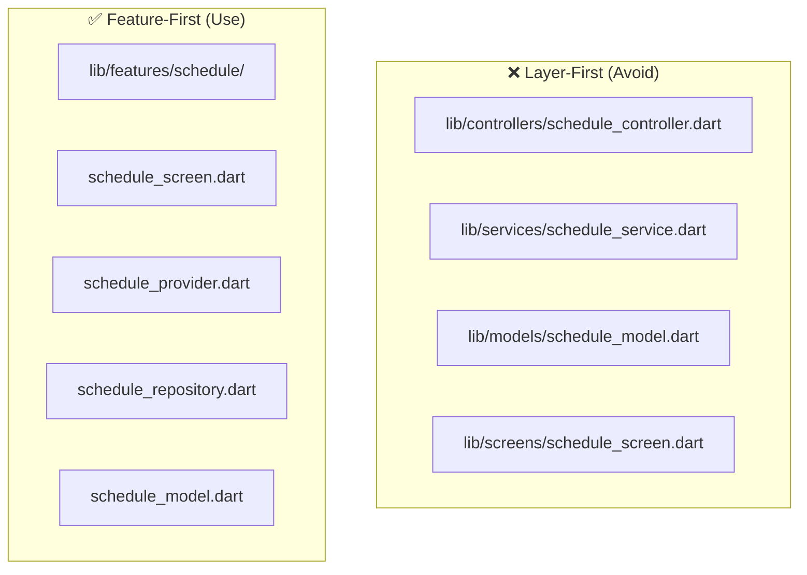
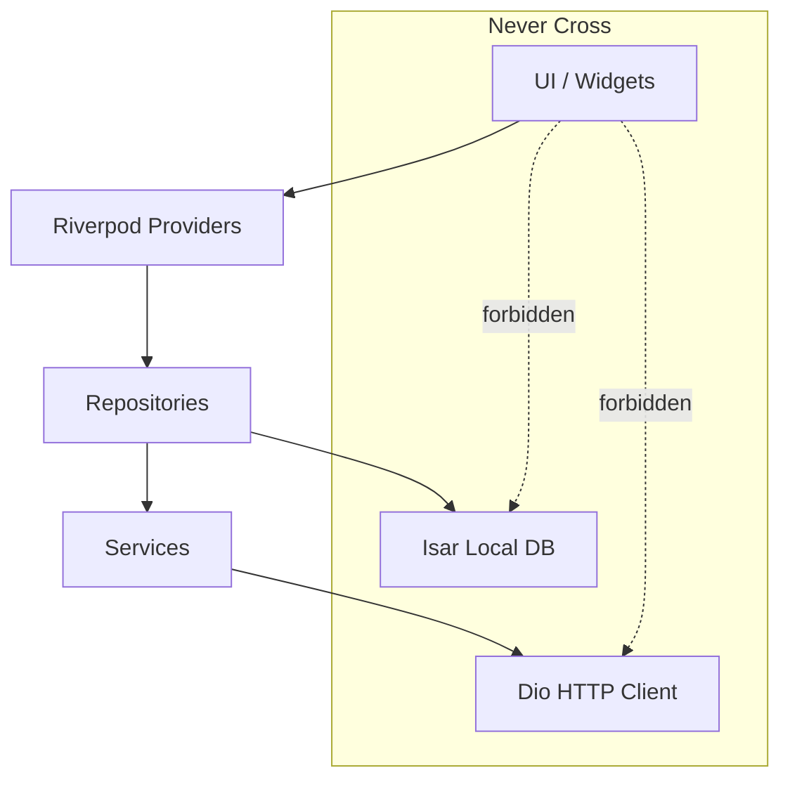
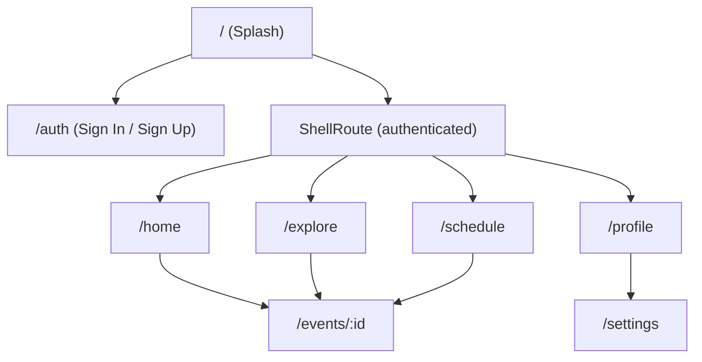
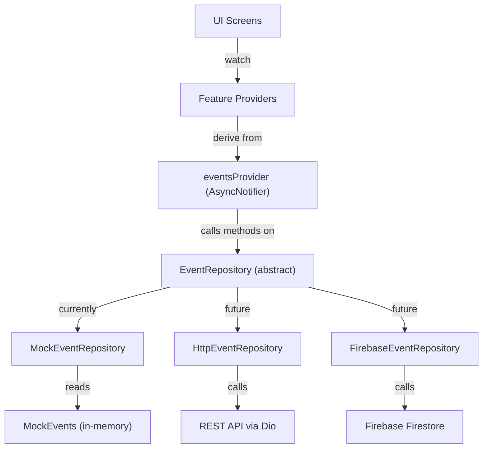
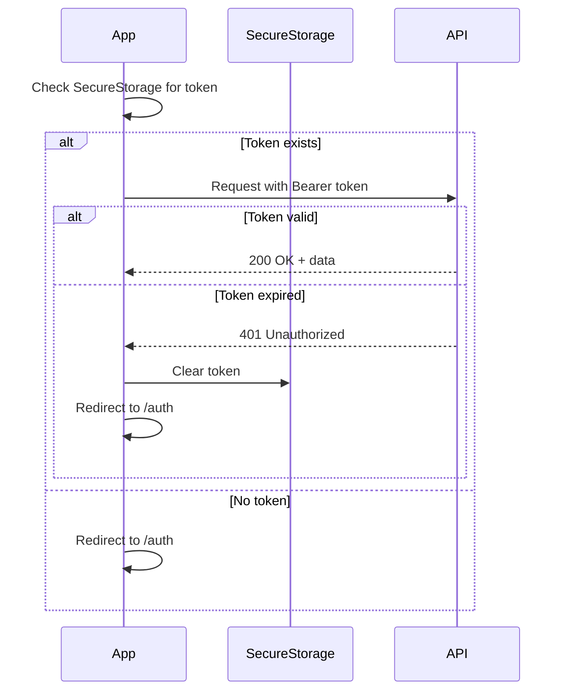
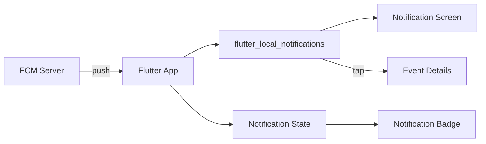

# Mobile App Architecture

> Technical architecture for the Flutter mobile module of the AI Event Tracker.

## Why Feature-First Architecture?

Traditional layer-first architecture (`lib/controllers/`, `lib/services/`, `lib/models/`) scatters related code across many directories. An AI agent (or developer) working on the **Schedule** feature would need to touch 4+ directories.

**Feature-first** architecture groups everything a feature needs into one folder. An agent can implement, test, and modify a feature in isolation — without touching the rest of the codebase.



---

## High-Level Dependency Flow



**Rules:**

- UI widgets never call Dio or Isar directly.
- All data flows through Providers → Repositories → Services.
- Repositories decide: fetch from network, cache, or return local data.
- This makes offline mode and testing straightforward.

---

## State Management: Riverpod

### Provider Organization

Providers are **co-located with their feature**, not in a central file.

```
lib/features/auth/providers/auth_provider.dart
lib/features/events/providers/events_provider.dart
lib/features/schedule/providers/schedule_provider.dart
```

### Common Provider Patterns

| Pattern | When to Use | Example |
|---------|------------|---------|
| `FutureProvider` | One-time read (user profile, event details) | `eventDetailsProvider(id)` |
| `StreamProvider` | Real-time data (notifications) | `notificationsProvider` |
| `StateNotifierProvider` | Complex state (auth, search filters) | `authProvider`, `searchFiltersProvider` |
| `Provider` (computed) | Derived state (filtered events) | `filteredEventsProvider` |

### Example: Events Provider

```dart
// lib/features/events/providers/events_provider.dart

@riverpod
class EventsNotifier extends _$EventsNotifier {
  @override
  Future<List<Event>> build() async {
    final repo = ref.read(eventsRepositoryProvider);
    return repo.getEvents();
  }

  Future<void> refresh() async {
    state = const AsyncValue.loading();
    state = await AsyncValue.guard(() async {
      final repo = ref.read(eventsRepositoryProvider);
      return repo.getEvents(forceRefresh: true);
    });
  }
}
```

---

## Navigation: GoRouter

### Route Structure



### Key Principle: Reusable Event Details

The **event details screen** (`/events/:id`) is shared across Home, Explore, and Schedule. Never duplicate it.

### GoRouter Configuration (Skeleton)

```dart
// lib/core/router/app_router.dart

final goRouter = GoRouter(
  initialLocation: '/',
  redirect: (context, state) {
    final isLoggedIn = /* check auth state */;
    final isAuthRoute = state.matchedLocation.startsWith('/auth');
    if (!isLoggedIn && !isAuthRoute) return '/auth';
    if (isLoggedIn && isAuthRoute) return '/home';
    return null;
  },
  routes: [
    GoRoute(path: '/', builder: (_, __) => const SplashScreen()),
    GoRoute(path: '/auth', builder: (_, __) => const AuthScreen()),
    ShellRoute(
      builder: (_, state, child) => AppShell(child: child),
      routes: [
        GoRoute(path: '/home', builder: (_, __) => const HomeScreen()),
        GoRoute(path: '/explore', builder: (_, __) => const ExploreScreen()),
        GoRoute(path: '/schedule', builder: (_, __) => const ScheduleScreen()),
        GoRoute(path: '/profile', builder: (_, __) => const ProfileScreen(),
          routes: [
            GoRoute(path: 'settings', builder: (_, __) => const SettingsScreen()),
          ],
        ),
      ],
    ),
    GoRoute(path: '/events/:id', builder: (_, state) {
      final id = state.pathParameters['id']!;
      return EventDetailsScreen(eventId: id);
    }),
  ],
);
```

---

## Data Layer Architecture

### Repository Pattern (Implemented — Decision D11)

Every feature that accesses data has a **repository**. The repository uses an **abstract interface** so that implementations can be swapped without changing any UI code.



**Swap point:** `lib/core/providers/repository_providers.dart` — change ONE line to switch implementations.

### Abstract Interface

```dart
// lib/features/events/repositories/event_repository.dart

abstract class EventRepository {
  Future<List<EventModel>> getEvents();
  Future<EventModel?> getEventById(String id);
  Future<void> toggleBookmark(String eventId);
  Future<List<EventModel>> searchEvents(String query);
  Future<List<EventModel>> getEventsByFilter({
    String? category,
    String? city,
    bool? isOnline,
    List<String>? tags,
  });
}
```

### Dependency Injection

```dart
// lib/core/providers/repository_providers.dart

final eventRepositoryProvider = Provider<EventRepository>((ref) {
  return MockEventRepository();  // ← Change this ONE line for real backend
  // return HttpEventRepository(ref.read(dioProvider));
});
```

### Global State (AsyncNotifier)

```dart
// lib/features/events/providers/events_provider.dart

class EventsNotifier extends AsyncNotifier<List<EventModel>> {
  @override
  Future<List<EventModel>> build() async {
    final repository = ref.watch(eventRepositoryProvider);
    return await repository.getEvents();
  }

  Future<void> toggleBookmark(String eventId) async {
    // Optimistic update for snappy UI
    state = state.whenData((events) => events.map((e) {
      if (e.id == eventId) return e.copyWith(isBookmarked: !e.isBookmarked);
      return e;
    }).toList());

    try {
      await ref.read(eventRepositoryProvider).toggleBookmark(eventId);
    } catch (e) {
      ref.invalidateSelf(); // Revert on failure
    }
  }
}
```

---

## Package Architecture

### Core Packages & Their Roles

| Package | Role | Where Used |
|---------|------|-----------|
| **Riverpod** | State management | All features |
| **GoRouter** | Declarative navigation | `core/router/` |
| **Dio** | HTTP client with interceptors | `core/network/` |
| **Freezed + json_serializable** | Immutable models + JSON parsing | `features/*/models/` |
| **Isar** | Local NoSQL database (offline cache) | `core/database/` |
| **flutter_secure_storage** | Secure token storage | `core/storage/` |
| **FCM + flutter_local_notifications** | Push notifications | `features/notifications/` |
| **flutter_dotenv** | Environment variables | `core/config/` |
| **logger** | Structured logging | Throughout |
| **flutter_hooks** *(recommended)* | Reduces widget boilerplate | UI widgets |
| **very_good_analysis** *(recommended)* | Strict lint rules | Project-wide |

---

## Offline Strategy

```mermaid
flowchart TD
    A[User opens app] --> B{Network available?}
    B -->|Yes| C[Fetch from API]
    C --> D[Save to Isar cache]
    D --> E[Display data]
    B -->|No| F[Load from Isar cache]
    F --> G[Display cached data]
    G --> H[Show "offline" indicator]

    C -->|Error| F
```

### Offline Behavior by Feature

| Feature | Offline Support | Behavior |
|---------|----------------|----------|
| Events list | ✅ Full | Shows cached events, retry on reconnect |
| Event details | ✅ Full | Shows cached details |
| Search | ⚠️ Partial | Local search on cached events only |
| Bookmarks | ⚠️ Queued | Saved locally, synced when online |
| Auth | ❌ None | Requires network |
| Profile update | ⚠️ Queued | Saved locally, synced when online |

---

## Authentication Flow



- **JWT tokens** stored in `flutter_secure_storage`.
- **Dio interceptor** attaches `Authorization: Bearer <token>` to all requests.
- **401 response** → clear token → redirect to auth screen.

---

## Notification Architecture



- Backend sends event-specific notifications via FCM.
- `flutter_local_notifications` handles foreground display.
- Tapping a notification navigates to the relevant event details screen.
- Unread count tracked via Riverpod for badge display.

---

## Dependency Injection

All dependencies are provided through Riverpod. No manual DI containers.

```dart
// lib/core/providers/providers.dart

@Riverpod(keepAlive: true)
Dio dio(DioRef ref) {
  final dio = Dio(BaseOptions(baseUrl: Env.apiBaseUrl));
  dio.interceptors.add(AuthInterceptor(ref));
  dio.interceptors.add(LogInterceptor());
  return dio;
}

@Riverpod(keepAlive: true)
Isar isar(IsarRef ref) {
  return Isar.getInstance()!;
}

@Riverpod(keepAlive: true)
EventsApiService eventsApiService(EventsApiServiceRef ref) {
  return EventsApiService(ref.read(dioProvider));
}
```

---

## Error Handling Strategy

```mermaid
flowchart TD
    API[API Call] -->|Success| Data[Return Data]
    API -->|Error| Err{Error Type?}
    Err -->|Network| Toast[Show "No internet" + load cache]
    Err -->|401| Login[Redirect to login]
    Err -->|404| Empty[Show "Not found" state]
    Err -->|500| Toast2[Show "Something went wrong"]
    Err -->|Timeout| Retry[Retry with exponential backoff]
```

- **Network errors**: Fall back to cache, show offline banner.
- **Auth errors (401)**: Clear session, navigate to `/auth`.
- **Server errors (5xx)**: Show user-friendly message, allow retry.
- **Timeout**: Auto-retry up to 3 times with exponential backoff.

---

## Design System (Phase 1 Deliverable)

> The design system should be established in Phase 1 before any screen development.

| Element | Specification |
|---------|--------------|
| **Theme** | Light + Dark mode support via `ThemeData` |
| **Colors** | Defined in `core/theme/app_colors.dart` |
| **Typography** | Text styles in `core/theme/app_typography.dart` |
| **Spacing** | Consistent padding constants in `core/theme/app_spacing.dart` |
| **Border Radius** | Standardized in `core/theme/app_radius.dart` |
| **Components** | Reusable cards, buttons, inputs in `core/components/` |
