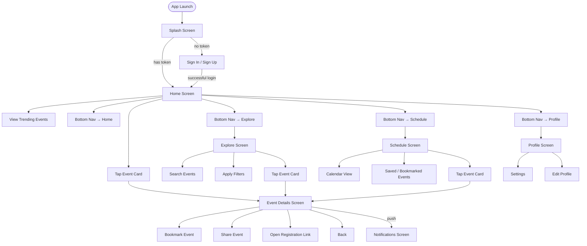
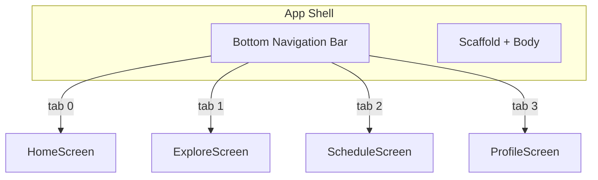

# Features & User Flows

> Screens, user flows, and feature specifications for the AI Event Tracker mobile app.

## Screen Inventory

| # | Screen | Route | Auth Required | Shell |
|---|--------|-------|:---:|:---:|
| 1 | Splash | `/` | ❌ | No |
| 2 | Sign In / Sign Up | `/auth` | ❌ | No |
| 3 | Home | `/home` | ✅ | Yes |
| 4 | Explore | `/explore` | ✅ | Yes |
| 5 | Event Details | `/events/:id` | ✅ | No (modal/slide) |
| 6 | Schedule | `/schedule` | ✅ | Yes |
| 7 | Profile | `/profile` | ✅ | Yes |
| 8 | Settings | `/profile/settings` | ✅ | No (push) |
| 9 | Notifications | `/notifications` | ✅ | No (push) |

---

## Complete User Flow



---

## Bottom Navigation Shell

The authenticated app uses a **bottom navigation bar** with 4 tabs:

| Tab | Icon | Route | Label |
|-----|------|-------|-------|
| 🏠 Home | `home_rounded` | `/home` | Home |
| 🔍 Explore | `search_rounded` | `/explore` | Explore |
| 📅 Schedule | `calendar_month_rounded` | `/schedule` | Schedule |
| 👤 Profile | `person_rounded` | `/profile` | Profile |



---

## Feature Specifications

### 1. Splash Screen

**Route**: `/`
**Auth**: None

**Behavior**:
1. Show app logo / animation (2 seconds).
2. Check `SecureStorage` for existing JWT token.
3. If token exists → navigate to `/home`.
4. If no token → navigate to `/auth`.
5. During check, validate token with backend (optional — can skip for speed).

**UI States**: Single static/animated screen. No interaction.

---

### 2. Authentication (Sign In / Sign Up)

**Route**: `/auth`
**Auth**: None

**Sub-screens**: Single screen with tab toggle between Sign In and Sign Up.

**Sign In Flow**:
1. User enters email + password.
2. Validate inputs (non-empty, email format, password length ≥ 6).
3. Call `POST /auth/login`.
4. On success → store JWT in `SecureStorage` → navigate to `/home`.
5. On failure → show error message below form.

**Sign Up Flow**:
1. User enters name + email + password + confirm password.
2. Validate inputs (all required, email format, passwords match, length ≥ 6).
3. Call `POST /auth/signup`.
4. On success → store JWT → navigate to `/home`.
5. On failure → show error message.

**UI States**:

| State | Display |
|-------|---------|
| Initial | Empty form |
| Loading | Spinner on button, inputs disabled |
| Error | Error text below form |
| Success | Navigate away |

**API Endpoints**: `POST /auth/login`, `POST /auth/signup`

---

### 3. Home Screen

**Route**: `/home`
**Auth**: Required
**Shell tab**: 0 (Home)

**Content**:
- **App Bar**: "AI Event Tracker" title, notification bell icon (with unread badge).
- **Trending Events Carousel**: Horizontal scroll of 5 featured/upcoming events.
- **Recent Events List**: Vertical list of events sorted by `start_date` descending.
- **Event Card**: Shows banner image, title, platform badge, date, mode (online/offline/hybrid), tags.
- **Pull to Refresh**: Refreshes event list.

**User Actions**:
- Tap event card → navigate to `/events/:id`.
- Pull down → refresh events.
- Tap notification bell → navigate to `/notifications`.

**UI States**:

| State | Display |
|-------|---------|
| Loading | Shimmer placeholders for cards |
| Success | Event cards populated |
| Empty | "No events found" illustration + "Explore events" button |
| Error | Error message + retry button |

**Provider**: `homeProvider` (wraps `eventsProvider` with trending logic).

---

### 4. Explore Screen

**Route**: `/explore`
**Auth**: Required
**Shell tab**: 1 (Explore)

**Content**:
- **Search Bar**: Debounced text input (300ms delay).
- **Filter Chips**: Horizontal scrollable chips for quick filters.
- **Event Grid/List**: Results matching search + filters.
- **Sort Options**: By date, by name, by platform.

**Filters Available**:
| Filter | Options |
|--------|---------|
| Mode | Online, Offline, Hybrid |
| Platform | Unstop, Hack2Skill, MLH, Devfolio, etc. |
| Status | Open registration, Closed, All |
| Date | Today, This week, This month, Custom range |

**Search Behavior**:
1. User types in search bar → debounce 300ms.
2. If offline → search cached events locally.
3. If online → call `GET /events/search?q=<query>&filters=...`.
4. Results update reactively.

**UI States**:

| State | Display |
|-------|---------|
| Initial | All events (no search/filter active) |
| Searching | Loading indicator in search bar |
| Results | Matching event cards |
| No results | "No events match your search" + clear filters button |
| Error | Error message + retry |

**API Endpoints**: `GET /events/search?q=`, `GET /events` with query params.

---

### 5. Event Details Screen

**Route**: `/events/:id`
**Auth**: Required

> ⚠️ **This is a REUSABLE screen** — accessed from Home, Explore, Schedule, and Notifications.

**Content**:
- **Banner Image**: Full-width event banner (or placeholder).
- **Title & Platform**: Event name + platform icon/badge.
- **Date & Time**: Start date, end date, countdown to registration deadline.
- **Mode Badge**: Online 🌐 / Offline 📍 / Hybrid 🔄.
- **Description**: Full event description.
- **Prize**: Prize pool (if available).
- **Team Size**: Team requirements (if available).
- **Tags**: Rendered as chips.
- **Registration Deadline**: Highlighted if approaching.
- **Action Buttons**:
  - **Bookmark**: Toggle bookmark (filled/outline icon).
  - **Share**: Share event link via system share sheet.
  - **Register**: Open `platform_url` in browser.

**UI States**:

| State | Display |
|-------|---------|
| Loading | Shimmer skeleton |
| Success | Full event details |
| Not found | "Event not found" + back button |
| Error | Error message + retry |

**API Endpoint**: `GET /events/:id`

---

### 6. Schedule Screen

**Route**: `/schedule`
**Auth**: Required
**Shell tab**: 2 (Schedule)

**Content**:
- **Segmented Control**: Toggle between "Calendar" and "Bookmarked" views.
- **Calendar View**: Monthly calendar with event dots on dates that have events. Tap a date to see events for that day below.
- **Bookmarked View**: List of user's bookmarked/saved events.
- **Event Card**: Same reusable card as Home.

**Calendar View Behavior**:
1. Display month calendar grid.
2. Dates with events show a colored dot indicator.
3. Tap a date → filter event list below to show events on that date.
4. Swipe left/right to change month.

**Bookmarked View Behavior**:
1. Load bookmarked events from `GET /users/me/bookmarks`.
2. Cache bookmarks in Isar for offline access.
3. Swipe to remove bookmark (with confirmation).

**UI States**:

| State | Display |
|-------|---------|
| Loading | Skeleton calendar + list |
| Calendar with events | Dots on relevant dates, list below |
| No events this month | "No events this month" message |
| No bookmarks | "No saved events yet" + "Explore events" button |
| Error | Error message + retry |

**API Endpoints**: `GET /users/me/bookmarks`, `POST /events/:id/bookmark`

---

### 7. Profile Screen

**Route**: `/profile`
**Auth**: Required
**Shell tab**: 3 (Profile)

**Content**:
- **Profile Header**: Avatar (initials or image), name, email.
- **Stats Row**: Number of bookmarks, events attended (future).
- **Menu Items**:
  - Edit Profile → in-place edit or modal.
  - Settings → navigate to `/profile/settings`.
  - About → app version, team info.
  - Sign Out → confirm dialog → clear storage → navigate to `/auth`.

**Edit Profile**:
1. User can update display name and (optionally) profile picture.
2. Call `PUT /users/me`.
3. Update local cache.

**Sign Out Flow**:
1. Show confirmation dialog ("Are you sure?").
2. On confirm → clear `SecureStorage` → clear Isar → navigate to `/auth`.

**API Endpoints**: `GET /users/me`, `PUT /users/me`

---

### 8. Settings Screen

**Route**: `/profile/settings`
**Auth**: Required

**Content** (toggle-based):

| Setting | Type | Default | Description |
|---------|------|---------|-------------|
| Dark Mode | Toggle | Off | Switches app theme |
| Push Notifications | Toggle | On | Enable/disable FCM notifications |
| Event Reminders | Toggle | On | Notify before registration deadline |
| Reminder Time | Picker | 24h before | How early to remind |
| Clear Cache | Button | — | Delete all local Isar data |
| App Version | Label | 1.0.0 | Read-only info |

---

### 9. Notifications Screen

**Route**: `/notifications` (accessed via bell icon on Home)
**Auth**: Required

**Content**:
- **Notification List**: Chronological list of push notifications.
- **Notification Tile**: Title, body, timestamp, read/unread indicator.
- **Tap Behavior**: Navigate to the relevant event details screen.
- **Mark All Read**: Clear all unread indicators.

**Notification Types**:

| Type | Trigger | Tap Action |
|------|---------|-----------|
| New Event | Event matching user interests is scraped | → Event Details |
| Deadline Reminder | Registration deadline approaching | → Event Details |
| Event Update | Event details changed (date, status) | → Event Details |

---

## Shared Components

These widgets live in `lib/core/widgets/` and are reused across features:

| Component | Used In | Description |
|-----------|---------|-------------|
| `EventCard` | Home, Explore, Schedule, Notifications | Event list item with banner, title, date, mode |
| `AppShell` | All authenticated screens | Bottom navigation + scaffold wrapper |
| `CustomAppBar` | Most screens | Consistent app bar with actions |
| `LoadingIndicator` | All screens | Full-screen or inline loading spinner |
| `ErrorView` | All screens | Error state with retry button |
| `OfflineBanner` | All screens | Dismissible "You're offline" banner |
| `FilterChipGroup` | Explore | Horizontal scrollable filter chips |

---

## User Personas (Design Reference)

| Persona | Description | Primary Use Case |
|---------|-------------|-----------------|
| **Student Dev** | College student looking for hackathons | Browse, search, bookmark upcoming competitions |
| **Working Professional** | Tech professional seeking conferences | Filter by mode (online/offline), set reminders |
| **Event Organizer** | Someone who wants to track industry events | Monitor specific platforms, get deadline alerts |

---

## Data Models Reference

### Event Model (see `features/events/models/event_model.dart`)

```dart
@freezed
class Event with _$Event {
  const factory Event({
    required String id,
    required String title,
    required String description,
    required String platform,
    required String platformUrl,
    String? bannerUrl,
    required EventMode mode,          // online | offline | hybrid
    required DateTime startDate,
    required DateTime endDate,
    DateTime? registrationDeadline,
    String? prize,
    String? teamSize,
    @Default([]) List<String> tags,
    required EventStatus status,     // active | completed | registrationClosed
    required DateTime createdAt,
    required DateTime updatedAt,
  }) = _Event;
}
```

### User Model (see `features/auth/models/user_model.dart`)

```dart
@freezed
class User with _$User {
  const factory User({
    required String id,
    required String email,
    required String name,
    String? avatarUrl,
    @Default([]) List<String> bookmarkedEventIds,
    required DateTime createdAt,
  }) = _User;
}
```
