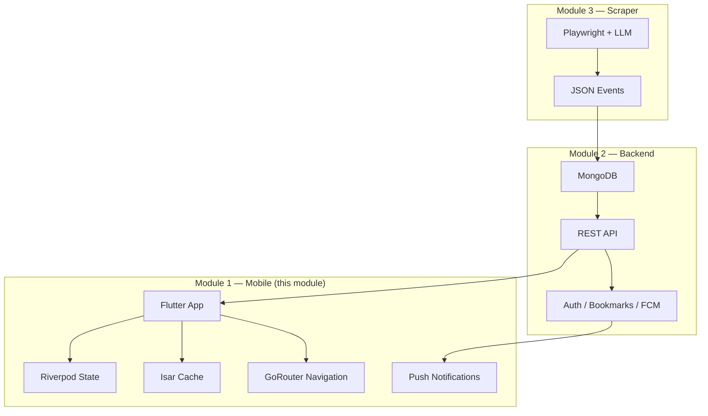
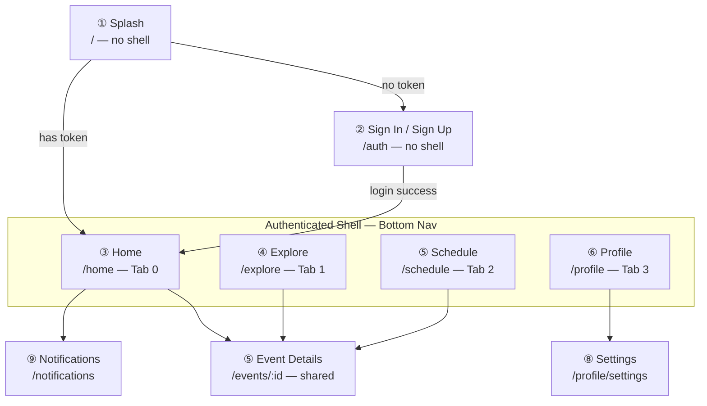
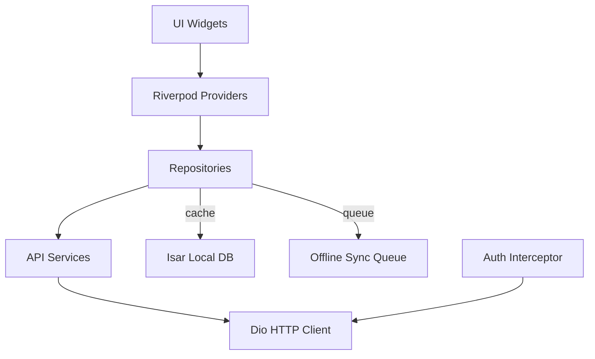

# Module 1 — Mobile Application

> **Flutter mobile app for the AI Event Tracker platform.**  
> This document provides a self-contained overview of the mobile module — its purpose, scope, tech stack, interfaces, and current status. Ideal as the first document to load when an AI agent starts a new session on this module.

---

## What Is This Module?

The mobile application is one of three independent modules in the AI Event Tracker project. It provides a **native-quality cross-platform experience (Android + iOS)** that lets users discover, search, bookmark, and receive notifications about AI and tech events aggregated from multiple platforms.

The app communicates exclusively through a **REST API** and maintains a **local offline cache** so users can browse events even without internet.

---

## Module Context



### Interface Contract

| Direction | Data / Protocol | Notes |
|-----------|----------------|-------|
| **Consumes** | `POST /auth/login`, `POST /auth/signup` | JWT token in response |
| **Consumes** | `GET /events`, `GET /events/:id`, `GET /events/search?q=` | Paginated, filterable |
| **Consumes** | `POST /events/:id/bookmark`, `GET /users/me/bookmarks` | Bookmark CRUD |
| **Consumes** | `GET /users/me`, `PUT /users/me` | Profile management |
| **Consumes** | `POST /fcm/token` | Register device for push |
| **Receives** | FCM push notifications | Event updates, deadline reminders |
| **Stores** | Local Isar database | Offline event cache, bookmark queue |

> The mobile module **never accesses** the scraper or database directly. All data flows through the backend REST API.

---

## Tech Stack

| Category | Package | Version Note |
|----------|---------|-------------|
| **Framework** | Flutter 3.x (Dart 3.12+) | Cross-platform |
| **State Management** | Riverpod | Feature-scoped providers |
| **Navigation** | GoRouter | Declarative, auth redirect |
| **HTTP Client** | Dio | Interceptors for auth + logging |
| **Data Models** | Freezed + json_serializable | Immutable + code-gen |
| **Local Database** | Isar | NoSQL offline cache |
| **Secure Storage** | flutter_secure_storage | JWT tokens |
| **Notifications** | FCM + flutter_local_notifications | Push + in-app |
| **Env Variables** | flutter_dotenv | API URLs, keys |
| **Logging** | logger | Structured output |
| **Hooks** *(recommended)* | flutter_hooks | Reduce widget boilerplate |
| **Linting** *(recommended)* | very_good_analysis | Consistent code quality |

---

## Screens at a Glance

The app contains **9 screens** organized into an authenticated shell with 4 bottom navigation tabs.



| # | Screen | Route | Auth | Tab | Description |
|---|--------|-------|:---:|:---:|-------------|
| 1 | Splash | `/` | ❌ | — | Logo + token check → redirect |
| 2 | Sign In / Sign Up | `/auth` | ❌ | — | Email/password auth forms |
| 3 | Home | `/home` | ✅ | 0 | Trending carousel + recent events |
| 4 | Explore | `/explore` | ✅ | 1 | Search bar + filters + event grid |
| 5 | Event Details | `/events/:id` | ✅ | — | **Reusable** — full event info + actions |
| 6 | Schedule | `/schedule` | ✅ | 2 | Calendar view + bookmarked events |
| 7 | Profile | `/profile` | ✅ | 3 | User info, edit, settings, sign out |
| 8 | Settings | `/profile/settings` | ✅ | — | Dark mode, notifications, cache clear |
| 9 | Notifications | `/notifications` | ✅ | — | Push notification history |

---

## Core Features

### 🔍 Discovery
- **Trending carousel** on Home showing featured upcoming events.
- **Search** with debounced input and text matching.
- **Filters** by mode (online/offline/hybrid), platform, status, and date range.

### 📅 Schedule
- **Calendar view** with event dots on dates that have events.
- **Bookmarked events** list with swipe-to-remove.

### 🔔 Notifications
- **Push notifications** via FCM for new events, deadline reminders, and event updates.
- **Notification screen** with read/unread state and tap-to-navigate.

### 💾 Offline Support
- **Isar cache** stores fetched events locally.
- **Offline banner** displayed when network is unavailable.
- Cached events browsable without internet.
- Bookmarks and profile updates **queued for sync** when back online.

### 🌙 Dark Mode
- Full dark/light theme support.
- Toggle in Settings.
- Persisted across sessions.

### 🔐 Authentication
- Email/password sign in and sign up.
- JWT stored securely in `flutter_secure_storage`.
- Automatic redirect to login on token expiry (401 response).

---

## Architecture Summary

The app uses a **feature-first** architecture where each feature (auth, events, explore, schedule, profile, settings, notifications) is an isolated folder containing everything it needs — data layer, models, providers, and presentation.



**Key rules:**
- UI never calls Dio or Isar directly.
- All data flows through Providers → Repositories → Services.
- Each feature is independently developable and testable.
- See [`ARCHITECTURE.md`](ARCHITECTURE.md) for full details.

---

## Directory Overview

```
lib/
├── main.dart                     # Entry point
├── app.dart                      # MaterialApp + router
├── core/                         # Shared infrastructure
│   ├── config/                   # Environment variables
│   ├── database/                 # Isar setup
│   ├── network/                  # Dio + interceptors
│   ├── router/                   # GoRouter config
│   ├── storage/                  # Secure storage
│   ├── theme/                    # Colors, typography, spacing
│   ├── utils/                    # Result type, validators
│   └── widgets/                  # Reusable widgets (EventCard, etc.)
│
└── features/                     # One folder per feature
    ├── auth/                     # Sign In, Sign Up, auth state
    ├── events/                   # Event model, repository, details screen
    ├── home/                     # Home screen, trending carousel
    ├── explore/                  # Search, filters
    ├── schedule/                 # Calendar, bookmarks
    ├── profile/                  # User info, edit
    ├── settings/                 # App preferences
    └── notifications/            # Push notifications, history
```

> See [`CODEBASE_GUIDE.md`](CODEBASE_GUIDE.md) for the complete directory tree with every file.

---

## Development Phases

| Phase | Focus | Backend? | Status |
|:-----:|-------|:---:|:------:|
| 1 | Research + Design System | ❌ | 🔲 Todo |
| 2 | Core Infrastructure (Dio, Riverpod, Router, Isar) | ❌ | 🔲 Todo |
| 3 | Authentication (mock) | ❌ | 🔲 Todo |
| 4 | Navigation Shell (all screens, dummy data) | ❌ | 🔲 Todo |
| 5 | Feature Development (Explore, Schedule, Profile) | ❌ | 🔲 Todo |
| 6 | Event Details (reusable screen) | ❌ | 🔲 Todo |
| 7 | Backend Integration (swap mock → real API) | ✅ | 🔲 Todo |
| 8 | Offline Mode (Isar caching) | ✅ | 🔲 Todo |
| 9 | Notifications (FCM) | ✅ | 🔲 Todo |
| 10 | Polish (dark mode, animations, testing) | ✅ | 🔲 Todo |

> **Phases 1–6 are fully independent of the backend.** The entire UI can be built with mock data.

See [`DEVELOPMENT_WORKFLOW.md`](DEVELOPMENT_WORKFLOW.md) for detailed phase specs, mock data strategy, and checklists.

---

## Team & Ownership

| Member | Role | Contact / Sync |
|--------|------|---------------|
| **Member 1** | Mobile Application (this module) | — |
| Member 2 | Backend (REST API, MongoDB, Auth) | API contract in PROJECT_OVERVIEW.md |
| Member 3 | Scraper + AI (Playwright, LLM) | No direct dependency |

The mobile module **depends on the backend** only from Phase 7 onward. Until then, all development uses mock data within the feature folders.

---

## Quick Start for AI Agents

**Load these files in order when starting a new session:**

| Priority | File | Why |
|:--------:|------|-----|
| 1 | [`MODULE1_MOBILE_OVERVIEW.md`](MODULE1_MOBILE_OVERVIEW.md) | ← You are here |
| 2 | [`PROJECT_OVERVIEW.md`](PROJECT_OVERVIEW.md) | Full project context, API contract |
| 3 | [`ARCHITECTURE.md`](ARCHITECTURE.md) | Patterns, state management, data flow |
| 4 | [`CODEBASE_GUIDE.md`](CODEBASE_GUIDE.md) | Directory structure, conventions |
| 5 | [`FEATURES_AND_FLOWS.md`](FEATURES_AND_FLOWS.md) | Screen specs, user flows |
| 6 | [`DEVELOPMENT_WORKFLOW.md`](DEVELOPMENT_WORKFLOW.md) | Phases, checklists, agent guidelines |

**Then read the codebase:**

```bash
# Current project status (fresh Flutter project)
cd "D:/Major Project/ai_event"
cat pubspec.yaml              # See dependencies
ls lib/                       # See current structure
```

> **Current Status**: The project is a freshly created Flutter project with only `main.dart` and the default `pubspec.yaml`. No dependencies beyond `cupertino_icons` and `flutter_lints` have been added. Development has not yet started.
