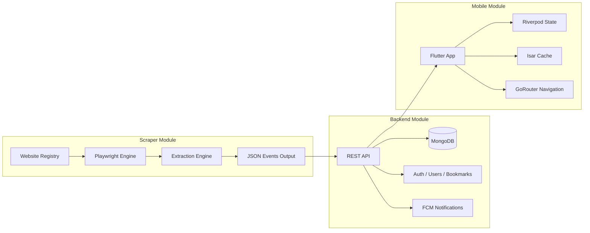
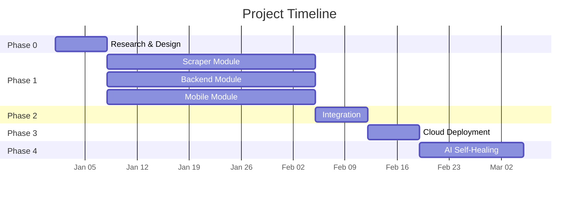

# AI Event Tracker — Project Overview

> **One-page summary for any AI agent joining the project.**

## What Is This Project?

**AI Event Tracker** is a mobile application that aggregates AI/tech-related events from multiple platforms (Unstop, Hack2Skill, Devfolio, MLH, Devpost, Eventbrite, etc.) into a single, searchable, and personalized feed.

### Problem

AI and tech events are scattered across dozens of platforms. Students and professionals must manually browse multiple websites to find relevant hackathons, competitions, conferences, and workshops — leading to missed opportunities and wasted time.

### Solution

A self-maintaining event aggregation platform that:

- **Scrapes** event data from multiple platforms automatically using a Playwright-based scraper with LLM-assisted self-healing.
- **Serves** aggregated, deduplicated, and categorized events via a REST API.
- **Delivers** a polished mobile experience with search, filters, bookmarks, schedule views, and push notifications.

---

## Project Structure (Three Independent Modules)



Each module has a **clearly defined interface** and can be developed, tested, and replaced independently.

---

## Team Allocation

| Member | Responsibility | Tech Stack |
|--------|--------------|------------|
| **Member 1** | **Mobile Application** (you) | Flutter, Riverpod, GoRouter, Dio, Isar |
| **Member 2** | **Backend** | MongoDB, REST API, Auth, Deployment |
| **Member 3** | **Scraper + AI** | Playwright, LLM Integration, Cloud Scraping |

---

## Overall Project Roadmap

| Phase | Duration | Focus | Dependencies |
|-------|----------|-------|-------------|
| **0 — Research** | 1 week | Individual research & design | None |
| **1 — Independent Dev** | 3–4 weeks | Each member builds their module in isolation | None |
| **2 — Integration** | 1 week | Connect scraper → backend → mobile | Phase 1 complete |
| **3 — Cloud Deploy** | 1 week | Docker, cloud hosting, monitoring | Integration complete |
| **4 — AI Self-Healing** | 1–2 weeks | LLM-based scraper repair (future work) | Stable system |



---

## Scraper Architecture (Context for Mobile Dev)

The scraper is **not your responsibility**, but understanding it helps you design the right data models and API contracts.

- **Approach**: Cached Hybrid (recommended) — Playwright runs the scraper; LLM generates/repairs extraction profiles only when cached selectors fail.
- **Anti-Blocking**: Staged approach — realistic browser behavior first, proxies only when needed.
- **Deduplication**: Event identity based on `registration_url` hash + `title` similarity + `dates`.
- **Synchronization**: Scraping is treated as a sync operation — new events inserted, updated events patched, unseen events (after N cycles) marked inactive.

### Data Sources (Planned)

Unstop, Hack2Skill, Devfolio, MLH, Devpost, Eventbrite (AI category), Lu.ma, Google Developer Groups, Microsoft Reactor, Hugging Face, NVIDIA, AWS, GitHub Events.

---

## API Contract (Expected from Backend)

> These are the **expected** endpoints. Confirm with Member 2 before integrating.

| Method | Endpoint | Description |
|--------|----------|-------------|
| `POST` | `/auth/signup` | Register new user |
| `POST` | `/auth/login` | Login, returns JWT |
| `GET` | `/events` | List events (paginated, filterable) |
| `GET` | `/events/:id` | Event details |
| `GET` | `/events/search?q=` | Search events |
| `POST` | `/events/:id/bookmark` | Bookmark/unbookmark |
| `GET` | `/users/me/bookmarks` | User's saved events |
| `GET` | `/users/me` | Current user profile |
| `PUT` | `/users/me` | Update profile |
| `POST` | `/fcm/token` | Register FCM device token |

### Expected Event Model

```json
{
  "id": "string",
  "title": "string",
  "description": "string",
  "platform": "string (unstop, hack2skill, etc.)",
  "platform_url": "string",
  "banner_url": "string",
  "mode": "online | offline | hybrid",
  "start_date": "ISO 8601",
  "end_date": "ISO 8601",
  "registration_deadline": "ISO 8601",
  "prize": "string?",
  "team_size": "string?",
  "tags": ["string"],
  "status": "active | completed | registration_closed",
  "created_at": "ISO 8601",
  "updated_at": "ISO 8601"
}
```

---

## Key Design Decisions

| Decision | Rationale |
|----------|-----------|
| **Feature-first architecture** | AI agents work better with isolated features than layered structures |
| **Isar for offline cache** | Fast NoSQL local DB ideal for caching event documents |
| **Cached Hybrid scraping** | 99% of scrapes run without LLM — only repairs when selectors break |
| **MongoDB for events** | Flexible document schema adapts to varied event fields across platforms |
| **Mock data during Phase 1** | Mobile can be fully built without backend dependency |

---

## Constraints & Assumptions

- **College project** — must be achievable within 7–9 weeks by a 3-person team.
- **Android + iOS** target via single Flutter codebase.
- **No admin panel** in Phase 1 — website registry managed via code/config.
- **Backend is REST** (not GraphQL) for simplicity.
- **FCM** is the push notification provider (Google ecosystem).
- **No fully autonomous LLM agent** in v1 — LLM used only for scraper repair.

---

## Future Work

- Autonomous agentic scraper (LLM-driven planner).
- Admin dashboard for managing website sources.
- Social features (share events, team finder).
- Event recommendation engine based on user interests.
- Multi-language support.
