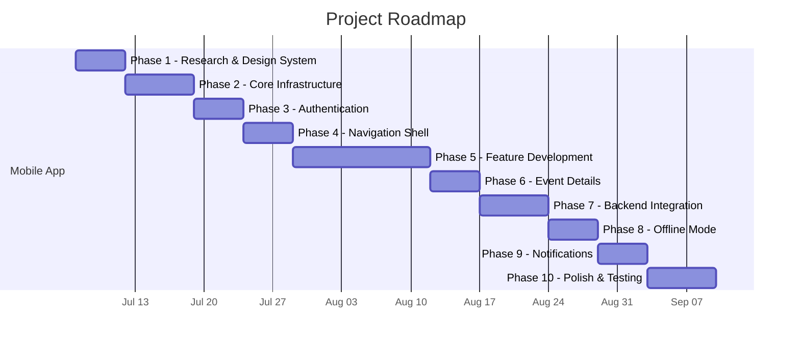

# AI Event Tracker — Master Roadmap

> **This is the first file every AI agent must read.**
>
> The AI Event Tracker is a mobile application that aggregates AI/tech events from multiple platforms (Unstop, Hack2Skill, Devfolio, MLH, Devpost, etc.) into a single searchable, bookmarkable feed with push notifications. The project consists of three independent modules: a Playwright-based scraper, a REST API backend, and a Flutter mobile app.

---

## Overall Progress

| Metric | Value |
|--------|-------|
| **Total Phases** | 10 |
| **Completed** | 0 |
| **In Progress** | 0 |
| **Blocked** | 0 |
| **Not Started** | 10 |
| **Overall Completion** | 0% |

---

## Current Active Phase

> **Phase 1 — Research & Design System**
> Status: **Not Started** | Completion: 0%
>
> The project is freshly initialized. Development has not yet started. The Flutter project exists with default `pubspec.yaml` only. No dependencies have been added.

---

## Completed Phases

> No phases have been completed yet.

---

## Blocked Items

| Item | Phase | Blocker | Since | Resolution |
|------|:-----:|---------|-------|------------|
| — | — | — | — | — |

> No items are currently blocked.

---

## Development Phases

| Phase | Name | Objective | Dependencies | Status | Progress | Module |
|:-----:|------|-----------|:------------:|:------:|:--------:|:------:|
| 01 | [Research & Design System](phases/PHASE_01.md) | Research Flutter, Riverpod, GoRouter. Establish design system (theme, colors, typography). | None | Not Started | 0% | Mobile |
| 02 | [Core Infrastructure](phases/PHASE_02.md) | Set up Dio, Riverpod, GoRouter, Isar, SecureStorage, mock data layer. | Phase 01 | Not Started | 0% | Mobile |
| 03 | [Authentication](phases/PHASE_03.md) | Build Sign In / Sign Up screens with mock authentication flow. | Phase 02 | Not Started | 0% | Mobile |
| 04 | [Navigation Shell](phases/PHASE_04.md) | Build AppShell with bottom navigation and all screen placeholders with dummy data. | Phase 03 | Not Started | 0% | Mobile |
| 05 | [Feature Development](phases/PHASE_05.md) | Build Explore (search + filters), Schedule (calendar + bookmarks), and Profile features independently. | Phase 04 | Not Started | 0% | Mobile |
| 06 | [Event Details](phases/PHASE_06.md) | Build the reusable Event Details screen accessible from Home, Explore, Schedule, and Notifications. | Phase 05 | Not Started | 0% | Mobile |
| 07 | [Backend Integration](phases/PHASE_07.md) | Replace all mock data with real API calls. Connect auth, events, bookmarks, and profile to the backend. | Phase 06, Backend API | Not Started | 0% | Mobile + Backend |
| 08 | [Offline Mode](phases/PHASE_08.md) | Implement Isar caching for events, offline reading, bookmark sync queue, and offline banner. | Phase 07 | Not Started | 0% | Mobile |
| 09 | [Notifications](phases/PHASE_09.md) | Integrate FCM push notifications, notification screen, unread badges, and tap-to-navigate. | Phase 07 | Not Started | 0% | Mobile |
| 10 | [Polish & Testing](phases/PHASE_10.md) | Dark mode, animations, shimmer loading, pull-to-refresh, accessibility, unit + widget tests, performance audit. | Phase 08, Phase 09 | Not Started | 0% | Mobile |

---

## Future Phases

> The following are **not yet planned in detail** and are listed for long-term visibility.

| Future Phase | Description | Priority |
|:------------:|-------------|:--------:|
| 11 | Autonomous AI scraper upgrade (LLM-driven planner) | Low (future work) |
| 12 | Admin dashboard for managing website sources | Low (future work) |
| 13 | Social features (share events, team finder) | Low (future work) |
| 14 | Event recommendation engine based on user interests | Low (future work) |
| 15 | Multi-language support | Low (future work) |

---

## Project Milestones

| # | Milestone | Target Phase | Status | Target Date |
|---|-----------|:------------:|:------:|-------------|
| M1 | Design system established and theme defined | Phase 01 | Not Started | — |
| M2 | Core infrastructure operational (Dio, Riverpod, Router, DB) | Phase 02 | Not Started | — |
| M3 | User can sign in / sign up (mock) | Phase 03 | Not Started | — |
| M4 | Navigable app skeleton with all screens visible | Phase 04 | Not Started | — |
| M5 | Explore, Schedule, and Profile features functional with mock data | Phase 05 | Not Started | — |
| M6 | Event Details screen reusable from all entry points | Phase 06 | Not Started | — |
| M7 | **First fully functional release** — app connected to real backend | Phase 07 | Not Started | — |
| M8 | App works offline with cached event data | Phase 08 | Not Started | — |
| M9 | Push notifications working end-to-end | Phase 09 | Not Started | — |
| M10 | **Production-ready release** — polished, tested, performant | Phase 10 | Not Started | — |

---

## Phase Status Legend

| Status | Color | Meaning |
|--------|-------|---------|
| **Not Started** | ⚪ | Phase has not begun. No work committed. |
| **In Progress** | 🔵 | Phase is actively being developed. |
| **Blocked** | 🔴 | Phase cannot proceed due to an external dependency or blocker. |
| **Completed** | 🟢 | Phase is finished. All tasks verified and documented. |

---

## Related Documentation

| Document | Purpose |
|----------|---------|
| [`MODULE1_MOBILE_OVERVIEW.md`](MODULE1_MOBILE_OVERVIEW.md) | Mobile module overview and tech stack |
| [`ARCHITECTURE.md`](ARCHITECTURE.md) | Technical architecture and patterns |
| [`CODEBASE_GUIDE.md`](CODEBASE_GUIDE.md) | Directory structure and conventions |
| [`FEATURES_AND_FLOWS.md`](FEATURES_AND_FLOWS.md) | Screen specs and user flows |
| [`DEVELOPMENT_WORKFLOW.md`](DEVELOPMENT_WORKFLOW.md) | Development phases and AI agent guidelines |
| [`AI_PROGRESS_RULES.md`](AI_PROGRESS_RULES.md) | **Mandatory rules for all AI agents** |
| [`phases/`](phases/) | Detailed per-phase task tracking |

---

## Changelog

| Date | Phase | Change |
|------|:-----:|--------|
| 2026-07-06 | — | Roadmap created. All 10 phases set to Not Started. |
